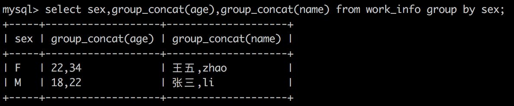

# 查询数据

基本语句

```MySQL
select 属性列表
       from 表名和视图列表
       [where 条件表达式1]
       [group by 属性名1 [having 条件表达式2]]
       [order by 属性名2 [ASC|DESC]]
```

查询条件

查询条件|关键字或符号
|-|-|
比较|=,<,<=,>,>=,!=,<>,!>,!<
指定范围|between and , not between and 
指定集合| in, not in
匹配字符| like , not like
是否为空值| is null， is not null
多个查询条件| and、or 
|||

## 关键字

### in 和 between and 关键字

`where 属性 [not] in （可选范围）`
`where 属性 [not] between 值1 and 值2`

### like关键字

`where 属性 [not] like '字符串'`

* %表示任意数量个字符串，可以是0个
* _表示一个字符

如果只是匹配两个字符的姓名，如“张什么”则用两个下划线，因为汉字为两个字符：“张_ _”。被匹配的字符串需要加引号，单引号或双引号均可。

### null关键字

`where 属性 is [not] null`

is null是个整体，不能用=null

### and关键字

`条件表达式1 and 条件表达式2`

### or关键字

`条件表达式1 or 条件表达式2`

### distinct关键字

`select distinct 属性名。。。`

### order by 关键字

`order by 属性名 [ASC|DESC]`

### group by 关键字

group by 在单独使用时，仅显示每个分组的一条记录，因此该函数一般不单独使用，与集合函数一起使用。

#### group_concat()



#### 集合函数

select 属性名，集合函数 from 表名 group by 属性名；

#### having

`select 属性列表 from 表名 group by 属性名 having 条件；`

#### 多个字段分组

`select 属性列表 from 表名 group by 属性1，属性2；`

#### with rollup

`select 属性列表 from 表名 group by 属性 with rollup;`

即在最后添加合计数目。

### limit关键字

#### 不指定初始位置

`limit 记录数量`

#### 指定初始位置

`limit 初始位置，记录数量`

第一条记录的位置是0

## 使用集合函数

count(),sum(),avg(),max(),min()

## 链接查询

### 内连接

`where 表1.属性=表2.属性`

只查询指定字段相同的记录

### 外连接

#### 左连接

`select 属性 from 表1 left join 表2 on 表1.属性=表2.属性`

可以查询出表1中的所有记录，表2中只能查询出匹配的记录

#### 右连接

`select 属性 from 表1 right join 表2 on 表1.属性=表2.属性`

可以查询出表2中的所有记录，表1中的只能查询出匹配的记录

## 子查询

in
比较
exists
any
all

## 合并查询结果

```MySQL
select 语句1
  union|union all
select 语句2
  union|union all
select 语句n；
```

union 将重复的记录过滤掉
union all 将所有的信息都加载出来

## 为表和字段取别名

### 为表取别名

select * from 表名 表的别名

### 为字段取别名

select 属性名 as 属性别名 from。。。

## 使用正则表达式查询

